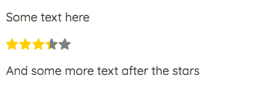
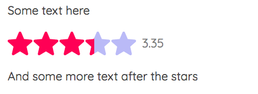

# Svelte Star Rating

🚧 Work in Progress 🚧

## What is this

A simple [svelte](https://svelte.dev/) component that shows a rating from 0 to 5 with svg stars when passed a number. No dependencies required.

## Installation

As with any other node package

```bash
npm install svelte-star-rating
```

or

```bash
yarn add svelte-star-rating
```

## Usage

The package exports a svelte component.

The component takes a number of props:

| Prop   | Type   | Default | Required | Description                                                   |
| ------ | ------ | ------- | -------- | ------------------------------------------------------------- |
| rating | Number | -       | Yes      | The rating. Any number from 0 to 5.0                          |
| id     | String | '000'   | No       | Not needed for a single instance. Read below for more details |
| config | Object | {}      | No       | Config options for the component. See below                   |

**About the id**: It is not needed for a single instace of the component. If the component appears more than once in the page, you **need** to pass a unique id each time for it to work properly.

**About the config object**:

| Option     | Type    | Default | Description                                     |
| ---------- | ------- | ------- | ----------------------------------------------- |
| fullColor  | Number  | -       | The color for the filling of the stars          |
| emptyColor | String  | '000'   | The color for the empty parts of the stars      |
| size       | Number  | 20      | The size of the stars. Pass a number of pixels. |
| showText   | Boolean | false   | Show the rating number next to the stars or not |

### Be aware

- Any css-valid color is accepted (hsl, hex, rgb, etc.).
- Stars are 1:1 proportionate (width equals height, so both equal the size property).
- If the rating number is shown, font size is half the star size or 16px, whatever is higher.

### Example

Use it as follows:

#### Simple

```html
<script>
  import StarRating from 'svelte-star-rating';
  const rating = 3.35;
</script>

<StarRating {rating} />
```

Output:



#### More advanced

```html
<script>
  import StarRating from 'svelte-star-rating';
  // id for ilustrative purposes. Ideally it would be generated, or passed from the app data
  const id = '42';
  const rating = 3.35;
  const config = {
    fullColor: '#f05',
    emptyColor: 'hsl(240, 80%, 85%)',
    size: 42,
    showText: true,
  };
</script>

<StarRating {id} {rating} {config} />
```

Output:



### Be careful

- Passing a rating higher than 5.0 or lower than 0.0 will break the component.
- Not passing a unique id if there are more than one component per page will make all of the copies to show the same rating.

## Future

- [ ] The component generates the unique id, no need to pass one.
- [ ] Check the user input rating and return an error or something more usefull than just breaking the thing.
- [ ] Improve styling of the rating number.
