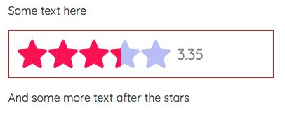

# Svelte Star Rating

## What is this

A simple [svelte](https://svelte.dev/) component that shows a rating from 0 to 5 with svg stars. Just need to pass a number. No dependencies required.

## Installation

As with any other node package in svelte:

```bash
npm install svelte-star-rating
```

But remember to install it as a **dev dependency** when using it with [SvelteKit](https://kit.svelte.dev/) (or [Sapper](https://sapper.svelte.dev/)):

```bash
npm install svelte-star-rating --save-dev
```

## Usage

The package exports a svelte component.

The component takes a number of props:

| Prop   | Type   | Default | Required | Description                                           |
| ------ | ------ | ------- | -------- | ----------------------------------------------------- |
| rating | Number | -       | Yes      | The rating. Any number from 0 to 5.0                  |
| config | Object | {}      | No       | Config options for the component. See below           |
| style  | String | -       | No       | CSS styles passed directly to the container component |
| id     | String | -       | No       | DEPRECATED                                            |

About the id: **DEPRECATED**. It was required for multiple instaces of this component to work correctly in the same page. The component now generates its own unique ids. Not needed anymore, will be removed in the next major update.

**About the config object**:

| Option     | Type    | Default   | Description                                     |
| ---------- | ------- | --------- | ----------------------------------------------- |
| fullColor  | String  | '#ffcf00' | The color for the filling of the stars          |
| emptyColor | String  | '#7f7f7f' | The color for the empty parts of the stars      |
| size       | Number  | 20        | The size of the stars. Pass a number of pixels. |
| showText   | Boolean | false     | Show the rating number next to the stars or not |

**About the style prop**: It accepts a string of css styles, written as inline-css. It is passed directly, unchecked, to the main `div` as inline-css. Use it cautiously.

### Be aware

- Passing a rating higher than 5.0 or lower than 0.0 will throw an error.
- The component is reactive since v1.3.0 (if rating value changes, the component will change the displayed rating).
- Any css-valid color is accepted (hsl, hex, rgb, string, etc.).
- Stars are 1:1 proportionate (width equals height, so both equal the size property).
- If the rating number is shown, font size is half the star size or 16px, whatever is higher.

### Example

Use it as follows:

#### Simple

```svelte
<script>
  import StarRating from 'svelte-star-rating';
</script>

<StarRating rating={3.35} />
```

Output:


#### More advanced

```svelte
<script>
  import StarRating from 'svelte-star-rating';
  const rating = 3.35;
  const config = {
    fullColor: '#f05',
    emptyColor: 'hsl(240, 80%, 85%)',
    size: 42,
    showText: true,
  };
  const style = 'border: 1px solid firebrick;padding: 12px;';
</script>

<StarRating {rating} {config} {style} />
```

Output:



## Future

- [ ] Write tests.
- [x] Check the user input rating and throw an error if not valid.
- [ ] Improve styling of the rating number.
- [x] The component generates the unique id, no need to pass one.
